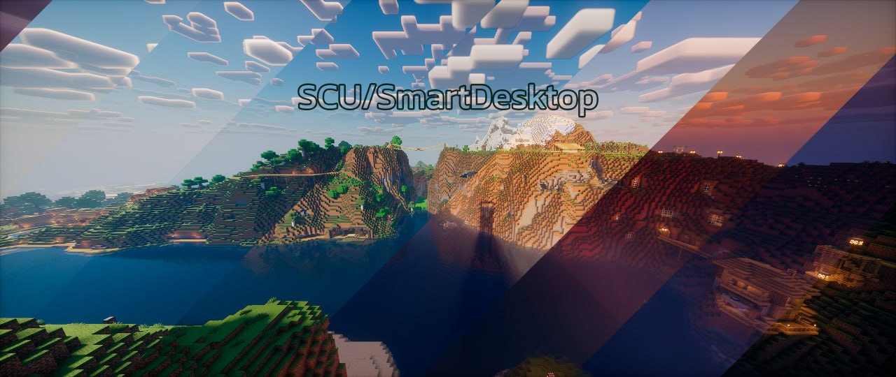

# Smart Desktop

A dynamic desktop wallpaper application that automatically changes wallpapers based on the sun's position throughout the day. The application displays beautiful day and night scenes that transition smoothly as the sun rises and sets, creating an immersive desktop experience synchronized with real-world time.



## Features

-   **Dynamic Wallpapers**: Automatically switches between day and night wallpapers based on your location and the sun's position
-   **Smooth Transitions**: Seamless image transitions as the sun progresses through the sky
-   **Real-time Clock**: Elegant animated clock display showing current time
-   **Day of Week Display**: Visual day-of-week indicator with smooth animations
-   **Location-based**: Uses your geographic coordinates to calculate accurate sunrise and sunset times
-   **Responsive Design**: Adapts to different screen resolutions

## How It Works

The application uses the SunCalc library to calculate the sun's position based on your latitude and longitude. It then displays appropriate wallpapers from the day and night image collections, transitioning between them as the sun progresses through the sky. The wallpapers change smoothly every few seconds to match the current sun position percentage.

## Configuration

Edit `config.js` to set your location and preferences:

```javascript
const latitude = 1, // Your latitude
    longitude = 1, // Your longitude
    scope = 6; // Display scale
```

## Usage

1. Configure your location in `config.js`
2. Open `index.html` in a KDE HTML Wallpaper or Wallpaper Engine for Windows
3. The application will automatically start displaying wallpapers based on the current sun position

## Assets

### Images

All wallpaper images (in the `day/`, `night/` directories) are property of Microsoft and are used under their respective license terms.

**⚠️ Important**: Microsoft's standard desktop wallpapers are typically protected by copyright and intended for personal use only. Using these images in open-source projects may violate Microsoft's terms of service. Users should verify licensing terms or replace these images with images that have open licenses (e.g., Creative Commons) or images they have rights to use.

### Font

The Minecraft font (`minecraft.ttf`) is used for the clock and day display:

-   **Copyright**: Pwnage_Block 2011
-   **Note**: Please verify the font license before using this project commercially

## Dependencies

-   [SunCalc](https://github.com/mourner/suncalc) - JavaScript library for calculating sun position, sunrise and sunset times
    -   Licensed under ISC License (compatible with MIT)

## Browser Compatibility

Works in modern web browsers that support:

-   ES6 JavaScript
-   CSS3 transitions
-   HTML5 Canvas/Image elements

## License

This project is licensed under the MIT License - see the [LICENSE](LICENSE) file for details.

The MIT License allows you to freely use, modify, and distribute the code, as long as you include the original copyright notice and license text.
